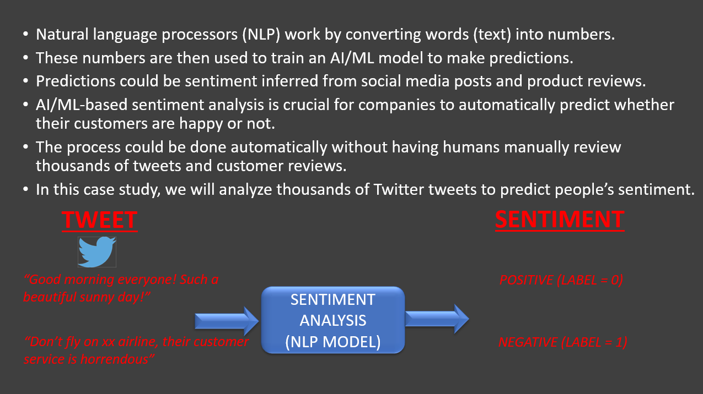

# NLP-twitter-sentiment-analysis

This Project is based on Natural Language Processing, a Sentiment Analysis on Twitter tweets.   
The [Twitter Dataset on Keglle](https://www.kaggle.com/arkhoshghalb/twitter-sentiment-analysis-hatred-speech) was used for the analysis. 

***

### Requirements  
  
- numpy
- pandas
- nltk
- seaborn
- Wordcloud
- scikitlearn

***
  
A **Naive Bayes** classification model is used to classify and predict sentiment on test data with an Accuracy of : 

